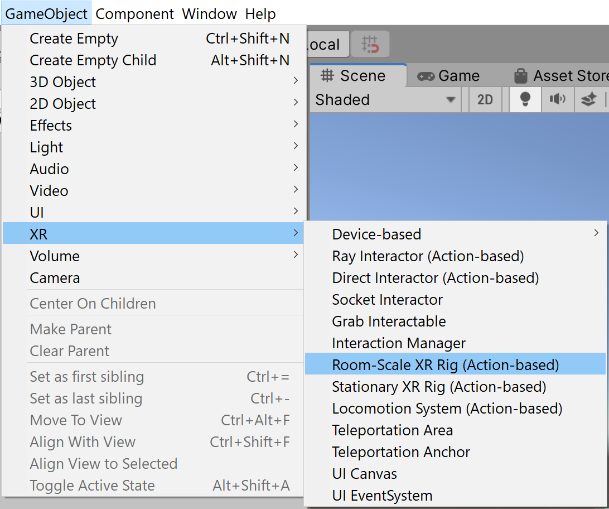
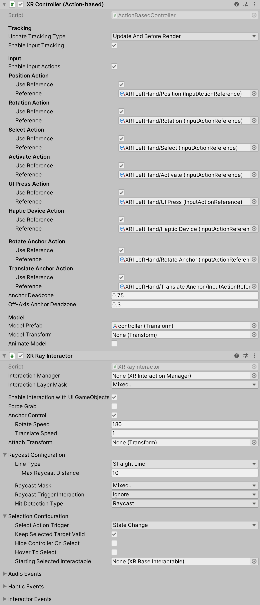
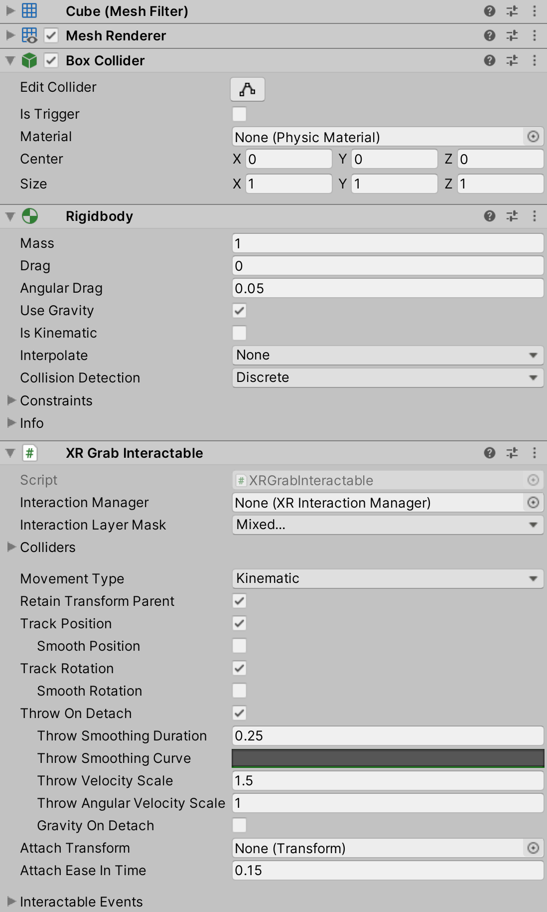
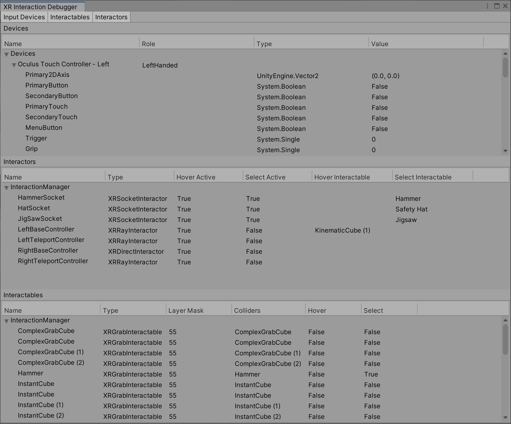
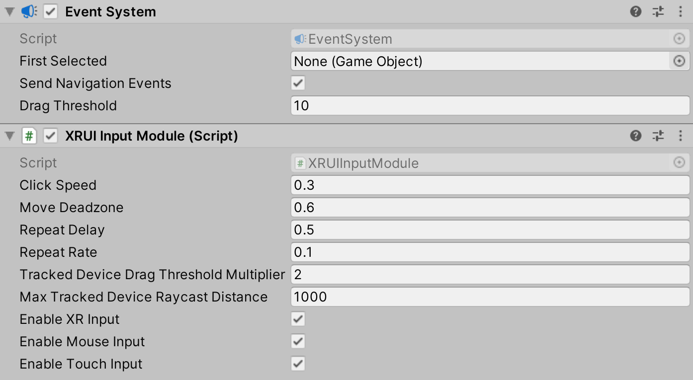
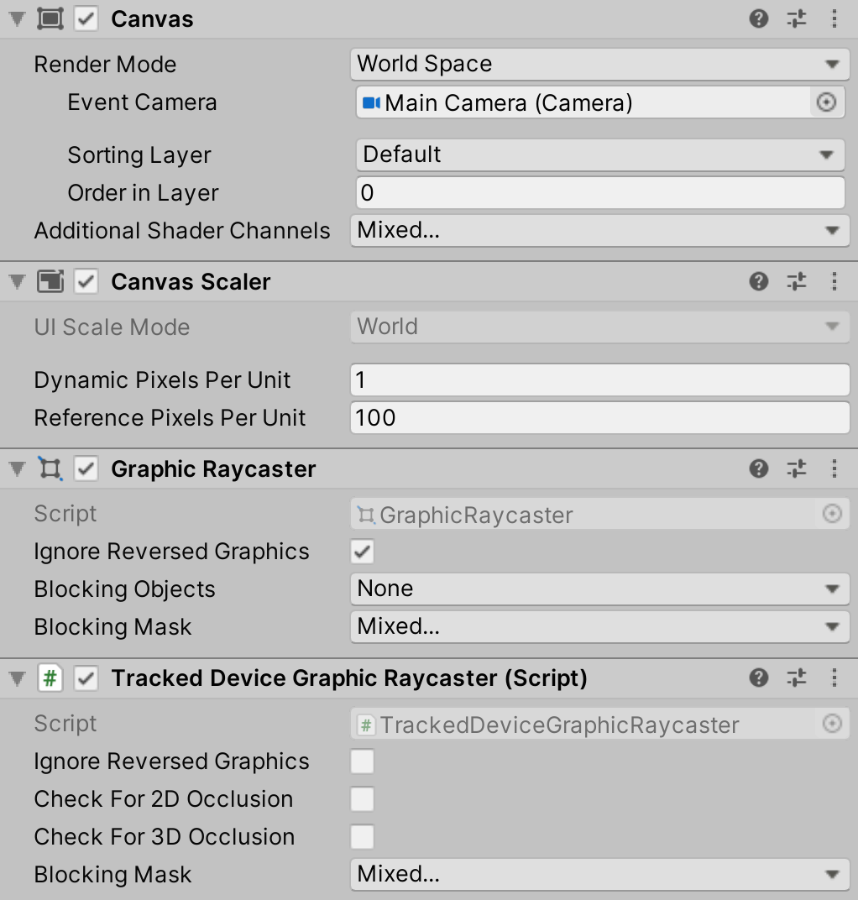
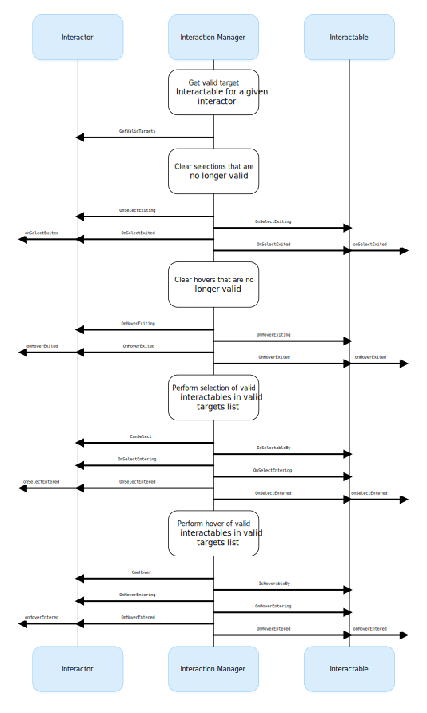
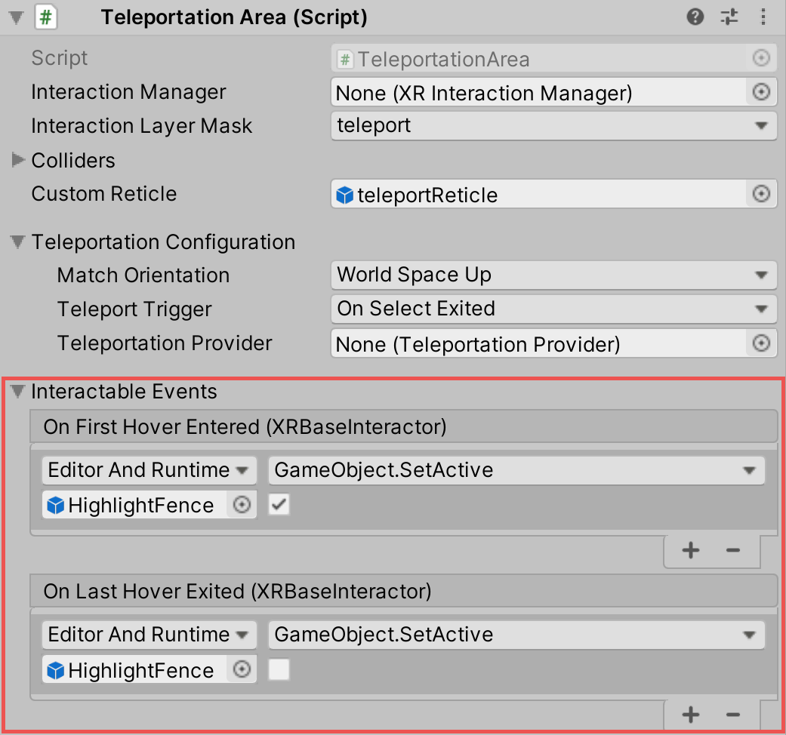

# XR Interaction Toolkit

The XR Interaction Toolkit package is a high-level, component-based, interaction system for creating VR and AR experiences. It provides a framework that makes 3D and UI interactions available from Unity input events. The core of this system is a set of base Interactor and Interactable components, and an Interaction Manager that ties these two types of components together. It also contains helper components that you can use to extend functionality for drawing visuals and hooking in your own interaction events.

XR Interaction Toolkit contains a set of components that support the following Interaction tasks:
- Cross-platform XR controller input
- Basic object hover, select and grab
- Haptic feedback through XR controllers
- Visual feedback (tint/line rendering) to indicate possible and active interactions
- Basic canvas UI interaction with XR controllers
- A VR camera rig for handling stationary and room-scale VR experiences

To use these AR interaction components, you must have the [AR Foundation](https://docs.unity3d.com/Manual/com.unity.xr.arfoundation.html) package in your Project. The AR functionality provided by the XR Interaction Toolkit includes:
- AR gesture system to map screen touches to gesture events
- AR interactable can place virtual objects in the real world
- AR gesture interactor and interactables to translate gestures such as place, select, translate, rotate, and scale into object manipulation
- AR annotations to inform users about AR objects placed in the real world

## Preview package

This package is available as a preview package, so it is still in the process of becoming stable enough to release. The features and documentation in this package might change before it is ready for release.

## Installing the package

To install this package, follow the instructions in the [Package Manager documentation](https://docs.unity3d.com/Manual/upm-ui-install.html).

This package has a dependency on [Input System](https://docs.unity3d.com/Packages/com.unity.inputsystem@1.0/manual/index.html). If that package has not already been installed, Unity will automatically add it to your Project. You might see a prompt asking you to enable input backends. Click **Yes** to accept it.

If your Project uses touches or gestures, you also need to perform the following configuration steps:

1. From Unity's main menu, go to **Edit &gt; Project Settings**, then select **Player &gt; Other Settings**.
2. Set **Active Input Handling** to **Both**.

For more information, see [Enabling the new input backends](https://docs.unity3d.com/Packages/com.unity.inputsystem@1.0/manual/Installation.html#enabling-the-new-input-backends) in the Input System package documentation.

## Installing samples

The package comes with a number of samples. You can install these directly from the Package Manager (from Unity's main menu, go to **Window &gt; Package Manager**). Select the XR Interaction Toolkit package, then click **Import** next to a sample to copy it into the current Project.

For more details about samples, see the [Samples](samples.md) page.

## Glossary

| Term | Meaning |
|-|-|
| Controller | A component that turns XR controller input such as a button press into interaction events like hover, or select. Also provides a way to show controller models and send haptic feedback to the controller. |
| Object | Anything that the user sees or interacts with in the virtual world. |
| Interactor | An object in a Scene that can select or move another object in that Scene. |
| Interactable | An object in a Scene that the user can interact with (for example, grab it, press it, or throw it). |
| Hover | The state where an Interactor is in a valid state to interact with an object. This differs between Ray and Direct interaction.|
| Select | The state where an Interactor is currently interacting with an object. |
| Interaction Manager | A manager component that handles interaction between a set of Interactors and Interactables. |
| Gesture | Sequences of movements that translate into an action that manipulates an interactable. |
| Annotation | A piece of content placed above (or next to) an AR object to give users information and context. |
| Haptic | Sensory or visual stimuli that is sent to the user to give feedback for interaction. |

## Setup

### Setup through GameObject menu

To set up a Scene for use with the XR Interaction Toolkit, use the commands in the **GameObject &gt; XR** menu to create Interaction GameObjects. You can drop Interactors, Interactables, and the XR Rig into the Scene from this menu.

### Interaction Manager

Every Scene that uses the XR Interaction Toolkit needs at least one Interaction Manager to facilitate interaction between Interactors and Interactables. By default, Interactors and Interactables reference the first Interaction Manager they find in the Scene if you don’t specify one. You can also break up larger Scenes with multiple Managers or turn specific ones on and off to enable sets of interaction.

### Controller/Interactor

An Interactor component controls how a GameObject interacts with other objects in the Scene. There are multiple types of Interactors. The example in the screenshot below uses a Ray Interactor, a component that uses [ray casting](https://docs.unity3d.com/ScriptReference/Physics.Raycast.html) in order to find valid Interactable objects in the Scene.

To receive input from an XR input device, the Interactor GameObject needs a Controller object. Add one of these to your Interactor GameObject and bind some or all of the following actions to an XR input device:

|Action|Required for|
|---|---|
|Position, Rotation, and Select|Basic interaction|
|Activate|Activating a selected object|
|UI Press|Interacting with UI objects|
|Haptic Device|Identifying the device to send haptic impulses to|
|Rotate and Translate Anchor|Manipulating a selected object at a distance|

The Controller and Interactor have limited support for haptic feedback. To enable haptic feedback for an XR Controller (Action-based), specify a **Haptic Device Action** with a binding path to an active control, such as `<XRController>{LeftHand}/*`. To enable haptic feedback for an XR Controller (Device-based), specify a **Controller Node** that supports haptic feedback, such as **Left Hand**. The Interactor can then specify intensities and durations of haptic feedback to play back on select and hover.

The **Enable Interaction with UI GameObjects** option controls whether this XR Ray Interactor can interact with Unity UI elements in the scene.

### Interactable

Interactable components define how the user can interact with objects in a Scene. In the screenshot below, the interactable GameObject supports grabbing, moving, dropping, and throwing.

Interactables added through the **GameObject &gt; XR** menu use a Sphere Collider to detect interaction, but other types of Collider components can provide better hit detection.

As an example, to set up an Interactable object that the user can grab, select it in your Scene and add these components:
- XR Grab Interactable
- A convex Mesh Collider

### Action-based vs. Device-based behaviors

Several behaviors, such as the [Snap Turn Provider](locomotion.md#snap-turn-provider), have two variants: an Action-based behavior and a Device-based behavior. Action-based behaviors use [Actions](https://docs.unity3d.com/Packages/com.unity.inputsystem@1.0/manual/Actions.html) to indirectly read input from one or more controls. Device-based behaviors use [`InputDevice.TryGetFeatureValue`](https://docs.unity3d.com/ScriptReference/XR.InputDevice.TryGetFeatureValue.html) to read input directly from an [`InputDevice`](https://docs.unity3d.com/ScriptReference/XR.InputDevice.html) from a specific control configured on the behavior itself.

It is recommended that you use the Action-based variant instead of the Device-based variant to take advantage of the benefits that the Input System package provides. Some features, such as the XR Device Simulator, are only supported when using Actions.

### Using Actions with Action-based behaviors

Actions must be enabled before they react to input. See [Using Actions](https://docs.unity3d.com/Packages/com.unity.inputsystem@1.0/manual/Actions.html#using-actions) in the Input System documentation for details about this process. Action-based behaviors in this package have properties of type [`InputActionProperty`](https://docs.unity3d.com/Packages/com.unity.inputsystem@1.0/api/UnityEngine.InputSystem.InputActionProperty.html) which can either store an Action directly, or indirectly by referencing an Action contained in an Input Action Asset. Action-based behaviors automatically enable and disable the Actions that are directly defined (that is, not a reference) during their on `OnEnable` and `OnDisable` events. Action-based behaviors don't automatically enable or disable the Actions that are indirectly defined (that is, a reference) to allow the enabled state to be managed externally.

The Input Action Manager behavior can be used to automatically enable or disable the Actions defined in an Input Action Asset during its own `OnEnable` and `OnDisable` events. As an example, you can add this behavior to a GameObject in your Scene and add all Input Action Assets that you make use of to the **Action Assets** list.

Note: For Input Actions to read from input devices correctly while running in the Unity Editor, the Game view must have focus. If you find that your input, such as button presses on the controllers, are not working, ensure the Game view has focus by clicking it with your mouse. A **Lock Input to Game View** option is available in the [Input Debugger](https://docs.unity3d.com/Packages/com.unity.inputsystem@1.0/manual/Debugging.html#input-debugger) window (**Window &gt; Analysis &gt; Input Debugger**). Enabling this option forces input to continue processing even when the Game view does not have focus.

To streamline setup of behaviors that use Actions, a [Default Input Actions Sample](samples.md#default-input-actions) is included with the package.

## Debugger window

The XR Interaction Toolkit Debugger window displays a top-down view of all the Input Devices, Interactables, and Interactors in a Scene. It also displays their relationship to each other and their parent Interaction Managers. To open this window, go to **Window &gt; Analysis &gt; XR Interaction Debugger** from Unity's main menu.

## InteractionLayerMask

The InteractionLayerMask is a mechanism for filtering which interactors can act upon which interactables.  Interactors and interactables that share at least one layer in their InteractionLayerMask are allowed to interact.  If an interactor and interactable do not share at least one layer in their InteractionLayerMask then they are not allowed to interact.  Mask comparisons do not consider the layer on an interactor's or interactable's GameObject.  Comparisons only consider the InteractionLayerMasks on the interactor and interactable.

InteractionLayerMasks use physics layers, but this mask is distinct from a raycast mask.  A raycast mask specifies what a raycast can hit. The InteractionLayerMask specifies whether an interactor and interactable can interact through state changes such as select and hover.

InteractionLayerMasks can be set on both interactors and interactables, and default to interact with all layers.

## UI interaction setup

To interact with Unity's built-in UI elements, you need to perform extra steps, particularly if you’re dealing with 3D-tracked devices. The XR Interaction Toolkit package provides a number of new components that you can use to convert an XR controller to work seamlessly with the UI, as well as helper menu options that handle basic configuration settings.

### Using the GameObject menu

The XR Interaction Toolkit package comes with menu items that perform basic setup. Use these helpers to create a new UI Canvas. You can access them from the **GameObject &gt; XR** menu.

|Helper|Function|
|---|---|
|**UI Canvas**|Creates a new world-space Canvas that you can add standard UI elements to. If you haven’t configured an Event System yet, it also creates and configures a new Event System for XR.|
|**UI EventSystem**|Creates a new Event System for XR, or modifies and selects the existing one in the loaded scenes.|

### Event System

The Event System component acts as a central dispatch for UI events to process input, and update individual active canvases. Additionally, each Event System needs an Input Module to process input. Use the default configuration, pictured below, as a starting point. Only one Input Module can be active at one time.

Note: If you already created a Canvas or you created the Event System first, you might have a Standalone Input Module component which might block input processing. Remove it by clicking the **More menu (&#8942;)** and selecting **Remove Component**.

### Canvas
All UI elements exist in the canvas. In the XR Interaction Toolkit, a user can only interact with canvases that have their **Render Mode** set to **World Space**. The XR Interaction Toolkit package contains a new component (pictured below) called the Tracked Device Graphic Raycaster. This component lets you use 3D tracked devices to highlight and select UI elements in that canvas.

## Architecture

### States

The Interaction system has three common states: Hover, Select, and Activate. These states can mean different things to different Interactables. Hover and Select are loosely related to the traditional GUI concepts of mouse-over and mouse-down. Activate is specific to XR.

| State | Function |
| - | - |
| **Hover** | If an Interactable is a valid target for the Interactor its state changes to Hover. Hovering on an object signifies an intention to interact with it, but doesn’t typically change the behavior of that object, though it might create a visual indicator for this change of state, like how a hovered button changes tint. |
| **Select** | Selection requires an action such as a button or trigger press from the user to enable the Selection state. When an Interactable is in the Selection state, Unity considers the selected Interactor to be interacting with it. For example, Selection can simulate picking up a grabbable object, holding a lever, or preparing to push a door that has focus via hovering. |
| **Activate** | Activation is an extra action, typically mapped to a button or trigger that affects the currently selected object. This lets the user further interact with an object they’ve selected. The Activate action depends on the Interactable. For example, you can use Activate to fire a gun that an Interactor has currently selected. You can hook the component to process Activate into an action without any additional code by hooking an existing callback using the Inspector window under **Interactable Events** and then add to **On Activate** via UnityEvents. |

### Components

#### Interactors
Interactor components handle the actions of hovering and selecting objects in the world. Any object with an Interactable component is registered with an Interaction Manager and checked each frame for the list of possible objects it can hover or select.

#### Interactables
Interactables are objects in a Scene that an Interactor can hover, select, and activate. By default, all Interactables can be affected by all Interactors. You can change this behavior by grouping Interactors and Interactables into complementary Interaction Managers. The Interactable defines the behavior of Hover, Select, and Activate. The same Interactor might be able to pick up and throw a ball, shoot a gun, or press a 3D button on a keypad.

#### Interaction Manager
The Interaction Manager acts as an intermediary between Interactors and Interactables. You can have multiple Interaction Managers, each with their own valid set of Interactors and Interactables. On `Awake`, both Interactors and Interactables register with the first found Interaction Manager, unless you already assigned them a specific Interaction Manager in the Inspector. The collection of loaded Scenes needs to have at least one Interaction Manager for the system to work.

#### Controllers
The XR Controller component provides a way to abstract input data and translate it into Interaction states, notably for selection and activation. Position, Rotation, Selection, and Activation events are bound via input actions to a specific device's controls, which Interactors then query.

You can also use the Controller Recorder component to record and play back Input data. You can use this to to test out interactions or run test Scenes without an XR device attached.

Note: Controller Recorder currently only works in the Unity Editor.

### Update loop
The update loop of the Interaction Manager queries Interactors and Interactables, and handles the hover and selection states. First, it asks Interactors for a valid list of targets (used for both hover and selection). It then checks both Interactors and Interactables to see if their existing hover and selection objects are still valid. After invalid previous states have been cleared (and exited via `OnSelectExiting` and `OnSelectExited`/`OnHoverExiting` and `OnHoverExited`), it queries both objects for valid selection and hover states, and the objects enter a new state via `OnSelectEntering` and `OnSelectEntered`/`OnHoverEntering` and `OnHoverEntered`.

All registered Interactables and Interactors are updated by the Interaction Manager explicitly to preserve update order. Interactables and Interactors do not use the normal `MonoBehaviour` `Update` call.

## AR interaction

Note: AR interaction components are only available while using Unity 2019.3 or later and in a Project that also includes the [AR Foundation](https://docs.unity3d.com/Manual/com.unity.xr.arfoundation.html) package. You can install the AR Foundation package via the [Package Manager](https://docs.unity3d.com/Manual/upm-ui-install.html).

### AR gestures

AR interaction is mostly driven by an AR Gesture Interactor component that translates touch events into gestures such as tap, drag, and pinch. These gestures get fed down to gesture Interactables that turn these into interactions.

The XR Interaction Tookit package comes with a number of pre-defined gestures and gesture interactables, but you can always extend this package by defining your own gestures.

| Gesture | Triggered by input | Maps to interactable |
|-|-|-|
| Tap | User touches the screen | AR Placement Interactable, AR Selection Interactable |
| Drag | User drags finger across screen | AR Translation Interactable |
| Pinch | User moves two fingers together or apart in a straight line | AR Scale Interactable |
| Twist | User rotates two fingers around a center point | AR Rotation Interactable |
| Two Finger Drag | User drags with two fingers | Nothing currently |

The AR Gesture Interactor component translates screen touches to gestures. Typically, you should place this component on the Camera or another object that has its position driven by the Tracked Pose Driver component. Unity feeds gestures down to Interactables, which then to respond to the gesture event.

### Placement of objects with the AR Placement Interactable

The AR Placement Interactable component facilitates placing objects in the Scene. Users specify a placement prefab that Unity later places on an AR plane when a tap occurs. Unity also generates a ray cast against the plane at the same time. The Prefab can contain additional AR interactables to facilitate further gesture interaction.

### AR annotations

Use the AR Annotation Interactable to place annotations alongside virtual objects in an AR Scene. These annotations are Prefabs that the application can show or hide when they satisfy a set of constraints. Each annotation has a minimum and maximum range from the Camera at which it displays, as well as a maximum Field of View (FOV) center offset from the Camera to hide or minimize annotations that are not centered in the user's view.

## Extending the XR Interaction Toolkit

You can extend the XR Interaction Toolkit system through either [inheritance](https://unity3d.com/learn/tutorials/topics/scripting/inheritance) or composition. Both Interactors and Interactables derive from an abstract base class that you can derive from and use to hook into the Interaction Manager to provide your own functionality. Additionally, you can use helpers, in particular event callbacks, to add functionality to the existing components.

### Interactor and Interactable event callbacks

Interactors and Interactables both have various event callbacks that can be used to drive reactions to interaction state changes. You can use these events to define your own behavior to hover, selection, and activation state changes with no additional coding.

### Extending Interactors

You can derive from the `XRBaseInteractor` and/or `XRBaseControllerInteractor` abstract base classes to define your own way of interacting with the world. Unity currently provides Direct (collision) and Ray Interactors, but you can decide how you want the user to choose objects in the world and what they can do with them (though typically you do the latter by deriving from the Base Interactable class).

In addition to standard Unity callbacks, you can override the following methods and properties:

|Method/Property|Description|
|---|---|
|`GetValidTargets`|Retrieves the list of interactables that this interactor can interact with this frame.|
|`isHoverActive`|Returns true if this Interactor is in a state where it could hover, false otherwise.|
|`isSelectActive`|Gets whether this interactor is in a state where it could select.|
|`CanHover`|Returns true if this Interactor is in a state where it could select, false otherwise.|
|`CanSelect`|Returns true if the Interactable is valid for selection this frame, false otherwise.|
|`isSelectExclusive`|Returns true if this Interactor requires exclusive selection of an Interactable, false otherwise.|
|`selectedInteractableMovementTypeOverride`|Gets the movement type to use when overriding the selected Interactable's movement.|
|`OnHoverEntering`|The Interaction Manager calls this method right before the Interactor first initiates hovering over an Interactable.|
|`OnHoverEntered`|The Interaction Manager calls this method when the Interactor first initiates hovering over an Interactable.|
|`OnHoverExiting`|The Interaction Manager calls this method right before the Interactor ends hovering over an Interactable.|
|`OnHoverExited`|The Interaction Manager calls this method when the Interactor ends hovering over an Interactable.|
|`OnSelectEntering`|The Interaction Manager calls this method right before the Interactor first initiates selection of an Interactable.|
|`OnSelectEntered`|The Interaction Manager calls this method when the Interactor first initiates selection of an Interactable.|
|`OnSelectExiting`|The Interaction Manager calls this method right before the Interactor ends selection of an Interactable.|
|`OnSelectExited`|The Interaction Manager calls this method when the Interactor ends selection of an Interactable.|

### Extending Interactables

You can derive from the `XRBaseInteractable` abstract base class to define your own way of interacting with the world. Currently, Unity only provides the Grab Interactable, but you can either create your own Interactables from the base class or derive from Grab Interactable if you want to adopt grabbing behavior.

In addition to standard Unity callbacks, you can override the following methods:

|Method|Description|
|---|---|
|`IsHoverableBy`|Determines if this Interactable can be hovered by a given Interactor.|
|`IsSelectableBy`|Determines if this Interactable can be selected by a given Interactor.|
|`OnHoverEntering`|The Interaction Manager calls this method right before the Interactor first initiates hovering over an Interactable.|
|`OnHoverEntered`|The Interaction Manager calls this method when the Interactor first initiates hovering over an Interactable.|
|`OnHoverExiting`|The Interaction Manager calls this method right before the Interactor ends hovering over an Interactable.|
|`OnHoverExited`|The Interaction Manager calls this method when the Interactor ends hovering over an Interactable.|
|`OnSelectEntering`|The Interaction Manager calls this method right before the Interactor first initiates selection of an Interactable.|
|`OnSelectEntered`|The Interaction Manager calls this method when the Interactor first initiates selection of an Interactable.|
|`OnSelectExiting`|The Interaction Manager calls this method right before the Interactor ends selection of an Interactable.|
|`OnSelectExited`|The Interaction Manager calls this method when the Interactor ends selection of an Interactable.|
|`OnSelectCanceled`|The Interaction Manager calls this method when the Interactor targeting this Interactable is disabled or destroyed.|
|`OnActivate`|The Interaction Manager calls this method when the Interactor sends an activation event down to an Interactable.|

The `onFirstHoverEntered` and `onLastHoverExited` events can be used to control highlight states of objects as they will correctly fire when the first highlight is detected, and when no other interactor is highlighting an object.

## Locomotion

The XR Interaction Toolkit package provides a set of locomotion primitives that offer the means to move about a Scene during an XR experience. These components are:
- An XR Rig that represents the user
- A Locomotion System that controls access to the XR Rig
- A teleportation system with teleportation destinations
- A Snap Turn Provider that rotates the rig by fixed angles
- A Continuous Turn Provider that smoothly rotates the rig over time
- A Continuous Move Provider that smoothly moves the rig over time

The [Locomotion](locomotion.md) documentation explains these sections in more detail.

## Technical details

### Requirements

This version of the XR Interaction Toolkit is compatible with the following versions of the Unity Editor:

* 2019.3 and later

### Document revision history

|Date|Reason|
|---|---|
|October 20, 2020|Documentation updated. Matches package version 0.10.0.|
|January 10, 2020|Removed private github link.|
|December 12, 2019|Fixed image linking.|
|December 4, 2019|Document revised with documentation team feedback.|
|October 3, 2019|Document update to reflect package naming for release.|
|September 4, 2019|Document revised with updated images and component names.|
|August 13, 2019|Document edits.|
|July 31, 2019|Finalized Locomotion documentation.|
|July 18, 2019|Document revised with Locomotion documentation.|
|July 10, 2019|Document revised with AR interaction documentation.|
|June 6, 2019|Document revised with updated UI module documentation.|
|May 30, 2018|Document revised with commands and updated component names.|
|May 1, 2018|Document created.|
